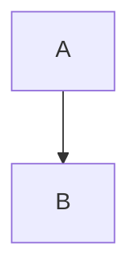

---
{"dg-publish":true,"permalink":"/med-uv/asignaturas-1er-ano/oh-1/anatomia/vasos/vena-porta-sync-conflict-20241017-211840-wqrbetx/"}
---

# Vena Porta
La vena porta es una gran vena que resume la mayor circulación venosa del tubo digestivo y órganos accesorios. 
## Origen
La vena porta es formada por la confluencia del tronco mesentérico-esplénico con la [[vena mesentérica superior\|vena mesentérica superior]].
## Recorrido
La vena porta inicia su recorrido en el tercio inferior del [[MedUv/ASIGNATURAS 1er AÑO/OH 1/Anatomía/Órganos/Esófago\|Esófago]] y llega hasta la mitad del [[Conducto Anal\|Conducto Anal]].  
## Afluentes
Llegan a la vena porta las siguientes venas:
- Las venas gástricas Izquierda y Derecha
- Las venas pancreatoduodenales
### Tributarias
- Ramas de la [[Vena esplénica\|Vena esplénica]]:
	- Venas gástricas cortas
	- Vena gastroomental izquierda
	- Mesentérica inferior
	- Ramos pancreáticos
- Ramas de la [[vena mesentérica inferior\|vena mesentérica inferior]]:
	- Venas rectales superiores
	- Venas sigmoideas
	- Vena cólica izquierda
- Ramas de la [[vena mesentérica superior\|vena mesentérica superior]]:
	- Venas Yeyunales
	- Venas ileales
	- Venas cólicas derechas
	- Vena ileocólica
	- Vena cólica media
	- Vena pancreatoduodenal inferior
	- Vena gastroomental derecha
- Ramas de la vena gástrica izquierda (van directo a la Vena Porta):
	- La parte izquierda de la curvatura menor de estómago
	- La parte distal del esófago

***
Índice: [[Índice de vasos\|Índice de vasos]]